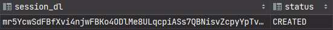

# Monitoring.Doc

Deployed on AWS [http://13.39.13.13:8080](http://13.39.13.13:8080/swagger-ui/index.html#/)

The goal of the project is to develop a software environment that will be a safe zone for
users with different access rights to interact directly with the objects of the system,
including communication with the API of the transport
company ["Delovye Linii"](https://www.dellin.ru/ "transport company Dellin") (API Dellin).


# Table of contents

1. <a href="Project_description">Project description</a>
2. <a href="installation">How to install and run the project</a>
3. <a href="using_project">How to use project</a>
4. <a href="junit_tests">Tests with Mockito JUnit</a>

## [Project description](Project_description "Project description")

The software environment provides a connection to the API Dellin, stores all information
about the received models, ensuring the confidentiality of information using modern
encryption tools.

The application includes the ability to authenticate and authorize users, access the API
and display information about received orders and documents.
The program provides user access to the functional part based on distributed roles
approved by the administrator. By the criterion of "access rights" users are divided into
the following categories:

- _Logistics department_ - the primary user who controls the transfer of information on
  key business processes;
- _Accounting Department_ - a secondary user with rights to read data and upload
  documentation;
- _Analytics Department_ - a secondary user with rights to read data and generate reports

**The application was developed in Java 11 version using these software tools:**

- `IntelliJ IDEA` - the main development environment
- `Postman` - creating collections for testing the developed API with requests
- _`GIT`_ - version control for secure development and subsequent sharing of code with
  other
  programmers
- `PostgreSQL` - a modern system that has a high-quality interface when running
  applications in the Java language
- `MobaXterm` - a terminal that allows you to access a virtual machine (a server for
  hosting APIs)
- `Amazon Web Services` - services that provide the ability to host server and database
  instances

**The project is built on the interaction of the following auxiliary libraries, programs
and technologies:**

- `Maven` - a framework for automating the build process and project management
- `SpringBoot Framework` - with numerous subsystems, allows you to create applications
  with simple configurations, makes development and deployment easier
- `RESTapi` - a way to communicate with our program, using HTTP protocols to transfer data
  and receive responses from the API
- `Spring Data JPA` - a mechanism for interacting with database entities
- `Mockito Junit` - used to test service classes
- `Lombok` - replacing standard methods with annotations to reduce code
- `Retrofit2` - [a Java client library](https://square.github.io/retrofit/) that uses HTTP
  and HTTPS protocols to transfer data and receive responses, but already when
  accessing Dellin. `Retrofit2` automatically serializes and deserializes data that
  is passed between client and server.
  It supports the execution of requests in asynchronous mode, which means it allows you to
  avoid blocking the user interface when performing long-running operations. See
  in [GitHub](https://github.com/square/retrofit)
- `JWT` - [JSON Web Token](https://jwt.io/) - encryption, which is one of the secure ways
  to transfer
  information between participants
- `Jasypt` - [a library](http://www.jasypt.org/ "official site") that provides
  basic
  encryption of
  text, numbers, but the important
  thing is that it is thread-safe and provides high performance in a multiprocessor
  environment. See in [GitHub](https://github.com/jasypt/jasypt)
- `Swagger` - interface description language for describing RESTful API

## [How to install and run the project](installation "How to install and run the project")

1. Clone the repository from `Git` using the command:

```
git clone https://github.com/ant0art/mondoc
```

2. Reload Maven project dependencies for updating sources
3. The program works with a `PostgreSQL` database. Decide where it will run: locally or
   remotely. The path to the database is required for the next step.
4. Set up required environment variables in `Dockerfile` (for remote start) or in `IDEA`
   (for local start):

> #### in Dockerfile:
>
>```dockerfile
>#first, you need to create an account with Dellin - https://www.dellin.ru/
>ENV passDL=<password_of_dellin_acc>
>ENV loginDL=<login_of_dellin_acc>
>ENV JASYPT_ENCRYPTOR_PASSWORD=<key_of_session_encryption>
>#second, you need to create a developer account with
>#Dellin API - https://dev.dellin.ru/registration/
>ENV appkey=<appkey_of_dellin_devtool>
>ENV secret=<key_of_authentication_and_authorization_encryption>
>#url format: <url>:port/databaseName
>ENV DATASOURCE_URL=<DB_Instance_after_"jdbc:postgresql://">
>#default: postgres
>ENV DATASOURCE_USERNAME=<database_login>
>#default: postgres
>ENV DATASOURCE_PASSWORD=<database_password>
>```
>
>#### in Intellij IDEA:
>
>1. `Run` -> `Edit Configurations...` -> `SpringBoot` -> `MondocApplication`
	> -> `Environment
	> variables`
>2. Write the same as in `Dockerfile` without "ENV"

**Important! When restarting**

5. Keep in mind that the first launch of the application creates several basic users
   to simplify interaction. **When restarting**, you need to comment out or delete the
   following command in `MondocApplication`:

```java
public class MondocApplication {
	
	@Bean
	public CommandLineRunner run(UserService userService, RoleService roleService) {
		return args -> {
			//some logic
		};
	}
}
```

6. Start the project:

> #### Remotely, for example AWS:
>
>```
>$sudo apt install docker.io
>$sudo service docker start
>$sudo docker build .
>$sudo docker run -d --net=host --restart=always XXX (where XXX - the first three chars 
>of running container
>```
>
>#### Localy with IDEA:
>
>Just run or debug (recommended).

7. To see the UI of Swagger write to your browser

> #### Remotely, for example AWS (deployed on AWS):
>
>```
>http://13.39.13.13:8080/swagger-ui/index.html#/
>```
>
>#### Localy with IDEA:
>
>```
>http://localhost:8080/swagger-ui/index.html
>```

### Having building .jar troubles:

1. To build project run Maven (clean package) excluding test
2. Hardcode environments to application.yml

## [How to use project](using_project "How to use project")

**Hidden by spoilers**
<details>
  <summary>Authentication </summary>


The program implements two-level authorization with different encryption algorithms.
When authenticating in the system, encrypted data transfer occurs. The user is assigned a
pair of access token and refresh token, which provide end-to-end access to the environment
interface.


For encryption at this stage, the JWT mechanism is used.
To answer the authorization request, the Bearer Authentication method is used, which
converts the existing token into the format of the BCrypt hardened hash function.


The pair of received tokens provides the user with time-limited access to the system and
is used as follows: after the expiration of the access token, a refresh token can be sent
to the system to replace the current pair and update the access period.


Retrofit2 is used to send requests to the API. It helps to send an HTTPS request, which
includes the data of the
application key, login and password, which are stored in encrypted form for a specific
user.
At the same time, user data - login and password - are stored in the database and
must
also be protected. Here is used another encoding algorithm of Jasypt library -
PBEWithMD5AndTripleDES - which uses a 168-bit key.



The received response contains the identification number of the session, with which the
user can access the API without entering a login and password. The session is also
stored in encrypted form and is overwritten on refresh to hide the ability to detect
patterns of encryption keys.

</details>

<details>
  <summary>Work with ...</summary>

- <details>
  <summary>Work with orders</summary>

  
  </details>
- <details> 
  <summary>Work with documents</summary>

  

  </details>

The issue of determining access rights is put before the company that uses the system.

Each user of the software environment has a role.
The software includes the ability to view data on orders and documents available in the
system. The roles defined for the user allow you to define the boundaries, where, for
example, a user with the `ADMIN` role can use the full functionality of the program and
upload a complete list of orders and documents, and a user with the `USER` role can only
use
those marked with a comment.

The most significant issue related to the relevance of the data is resolved as follows:
users with extended rights have the ability to manually update. At the same time, in their
absence, `the scheduler` is engaged in updating documents and orders. This approach takes
into account the recommended timeout for requests to the API, does not load the database
and the system during the period of active work of employees, since updates occur after
working hours.
See the
scheduler [OrderJob](/src/main/java/com/dellin/mondoc/jobs/OrderJob.java)

- <details>
  <summary>Work with comments</summary>

  
  </details>
- <details> 
  <summary>Work with companies</summary>

  

  </details>

At the same time, each user has a list of companies available to him. They are used to
unload from the API and give the user access to a different range of system data.

Each method that works with the database first sets the identity of the authorized user
using the `SecurityContextHolder`, gets a list of companies available to him and, based on
other required parameters, produces a response.

This approach allows you to reduce the load on the system and the waiting time to update
all orders in the database at the request of a `logistician` (`aka administrator`), if
he/she/they has
only one available company defined. In other words, the update will take place strictly
according to it.

In the case of `an accountant`, if he/she/they has only one company defined, the pool of
orders to display will only contain orders with comments and only for the company to which
he/she/they has access.

</details>

## [Tests with Mockito JUnit](junit_tests "Tests with Mockito JUnit")

To effectively test the service classes of a Java project, use the Mockito Junit library.

The tests used the open source relational DBMS `PostgreSQL`. Using `PostgreSQL` in tests
allows you to create more accurate and reliable tests, as well as conduct database
integration testing.


No need to test the `SyncService` - the service class with the methods provided by
`Retrofit2`.

